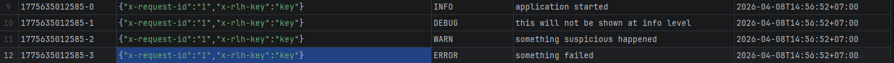
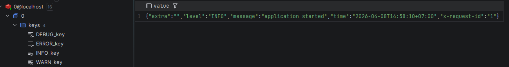

# go-redis-log-handler
`go-redis-log-handler` - is a handler for `slog` that sends structured logs to Redis.


### Installation:

```bash
go get github.com/paragonov/go-redis-log-handler
```

### Purpose:
- send logs to Redis Stream
- store logs as JSON structures
- use in Go applications that already use log/slog

### Dependencies:
- `github.com/redis/go-redis/v9` — Redis client
- `github.com/google/uuid` — library for generating UUIDs
- standard `log/slog` — for logging

### Usage example:
All available examples are located in the examples directory.


#### Example of storing logs in Redis Stream:


#### Example of storing logs in JSON format:
